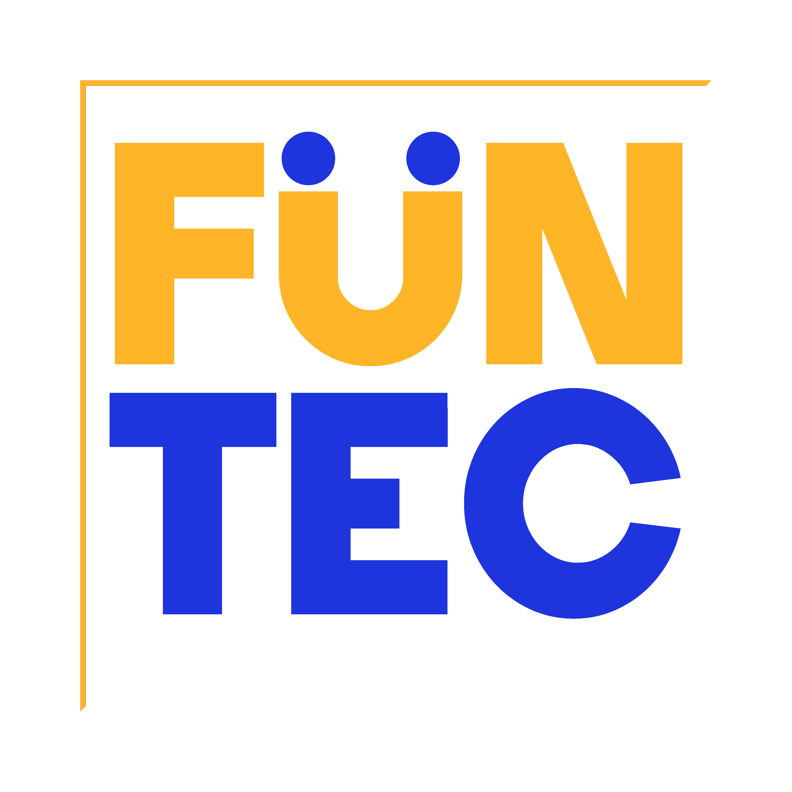

# 🎡 Funtec — Semi-3D Amusement Equipment Showcase Website

Welcome to the official repository of **Funtec**, an interactive, semi-3D web experience for showcasing amusement park products built by the Funtec company.

## 🌐 Live Website

Visit: [https://funtec.ir](https://funtec.ir)

## 🧠 About the Project

This project is a **semi-3D web platform** developed for **Funtec**, a company that designs and sells amusement park equipment. It uses cutting-edge web technologies to provide a modern, engaging experience that reflects the excitement and energy of our physical products.

### 🎯 Features

- 🌀 **Interactive 3D visuals** built using [Three.js](https://threejs.org/)
- ⚛️ **React.js** front-end with dynamic components and routing
- 🐘 **PHP** backend for handling content and server-side logic
- 🖼️ Eye-catching visuals that represent our brand and products
- 📱 Fully responsive design

## 🖥️ Tech Stack

| Technology | Role |
|------------|------|
| [Three.js](https://threejs.org/) | Real-time 3D rendering |
| [React.js](https://react.dev/) | Frontend framework |
| [PHP](https://www.php.net/) | Backend/server-side logic |
| HTML/CSS | Styling and structure |
| JavaScript | Client-side logic |

## 📁 Project Structure (Partial)

```
/public
  └── logo.png       # Company logo

/src
  ├── components/    # React components including 3D elements
  ├── assets/        # Static assets
  └── App.jsx        # Main entry point
```

## 📸 Preview



> Note: For best performance and 3D effects, please view the site on a modern browser with hardware acceleration enabled.

---

## 📬 Contact

If you'd like to collaborate or have questions, feel free to reach out or visit our website.

---

Built with ❤️ by [Taha Zolfi](https://taha-zolfi.github.io/site/)
